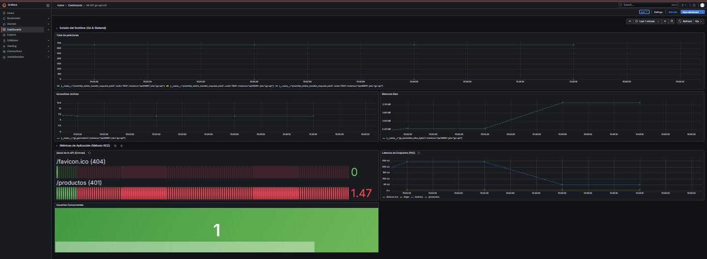

# 🚀 Go API Chi - E-commerce Backend


API RESTful en Go con Chi, PostgreSQL, Docker y Kubernetes.

## 🚀 Tech Stack
- **Go 1.23** - Lenguaje de programación
- **Chi** - Router HTTP ligero
- **PostgreSQL** - Base de datos
- **Docker** - Containerización
- **Kubernetes** - Orquestación
- **GitHub Actions** - CI/CD

## 📦 Docker
```bash
docker pull zaragoza95/go-api-chi:latest
```

> API REST robusta en Go para gestión de productos con JWT, Docker y Kubernetes.

---

## 📸 Vista Rápida

### Arquitectura

**Básica:**
```
┌──────────────┐      ┌──────────────┐      ┌──────────────┐
│   Cliente    │ ───▶ │   API Go     │ ───▶ │  PostgreSQL  │
│  (HTTP/JSON) │ ◀─── │ (Chi Router) │ ◀─── │   Database   │
└──────────────┘      └──────────────┘      └──────────────┘
```

**Con Observabilidad:**
```
┌──────────────┐      ┌──────────────┐      ┌──────────────┐
│   Cliente    │ ───▶ │   API Go     │ ───▶ │  PostgreSQL  │
│  (HTTP/JSON) │      │ (Chi Router) │      │   Database   │
└──────────────┘      └──────┬───────┘      └──────────────┘
                             │
                             │ GET /metrics (cada 30s)
                             ▼
                      ┌──────────────┐
                      │  Prometheus  │
                      │  (Métricas)  │
                      └──────┬───────┘
                             │
                             │ PromQL queries
                             ▼
                      ┌──────────────┐
                      │   Grafana    │
                      │ (Dashboards) │
                      └──────────────┘
```

### Ejemplo de uso
```bash
# Login
curl -X POST http://localhost:8080/login \
  -H "Content-Type: application/json" \
  -d '{"username":"admin","password":"password"}'

# Obtener productos
curl -X GET http://localhost:8080/productos \
  -H "Authorization: Bearer {token}"
```

---

## 🚀 Acceso Rápido

- 📖 **Documentación completa:** Ver [Endpoints](#endpoints)
- 🐳 **Docker Hub:** [zaragoza95/go-api-chi](https://hub.docker.com/r/zaragoza95/go-api-chi)
- 📊 **Dashboard Grafana:** [dashboard.json](./grafana/dashboard.json)
- 🔧 **CI/CD Pipeline:** [GitHub Actions](.github/workflows/ci.yml)
- 📈 **Métricas en vivo:** `http://localhost:9090` (Prometheus) | `http://localhost:3000` (Grafana)

---

## 📋 Tabla de Contenidos

- [Características](#características)
- [Tecnologías](#tecnologías)
- [Prerequisitos](#prerequisitos)
- [Instalación](#instalación)
- [Uso](#uso)
- [Endpoints](#endpoints)
- [Estructura del Proyecto](#estructura-del-proyecto)
- [Variables de Entorno](#variables-de-entorno)
- [Docker](#docker)

---

## ✨ Características

- ✅ CRUD completo de productos
- ✅ Autenticación JWT
- ✅ Middleware de seguridad
- ✅ Dockerizado con Docker Compose
- ✅ Base de datos PostgreSQL
- ✅ Health checks
- ✅ Validación de datos

---

## 🛠️ Tecnologías

- **Lenguaje:** Go 1.23+
- **Framework:** Chi Router v5
- **Base de Datos:** PostgreSQL 15
- **Autenticación:** JWT (JSON Web Tokens)
- **Containerización:** Docker & Docker Compose
- **ORM/Database:** database/sql (stdlib)

---

## 📦 Prerequisitos

- [Go](https://golang.org/dl/) 1.23 o superior
- [Docker](https://docs.docker.com/get-docker/) 20.10+
- [Docker Compose](https://docs.docker.com/compose/install/) v2.0+
- Git

---

## 🚀 Instalación

### 1. Clonar el repositorio
```bash
git clone git@github.com:Zaragoza9512/go-api-chi.git
cd go-api-chi
```

### 2. Configurar variables de entorno
```bash
# Copiar el archivo de ejemplo
cp .env.example .env

# Editar .env con tus valores
nano .env
```

### 3. Levantar con Docker Compose
```bash
# Construir y levantar contenedores
docker-compose up --build

# O en modo detached (segundo plano)
docker-compose up -d --build
```

La API estará disponible en: `http://localhost:8080`

---

## 💻 Uso

### Desarrollo Local (sin Docker)
```bash
# Instalar dependencias
go mod download

# Ejecutar la aplicación
go run main.go handlers.go dao.go security.go
```

### Con Docker
```bash
# Levantar servicios
docker-compose up

# Ver logs
docker-compose logs -f api

# Detener servicios
docker-compose down

# Detener y eliminar volúmenes (resetear BD)
docker-compose down -v
```

---

## 📡 Endpoints

### Autenticación

#### Login
```http
POST /login
Content-Type: application/json

{
  "username": "admin",
  "password": "password"
}
```

**Respuesta:**
```json
{
  "token": "eyJhbGciOiJIUzI1NiIsInR5cCI6IkpXVCJ9..."
}
```

---

### Productos (Requieren Autenticación)

Incluir header: `Authorization: Bearer {token}`

#### Crear Producto
```http
POST /productos
Content-Type: application/json
Authorization: Bearer {token}

{
  "name": "Laptop Dell XPS 15",
  "description": "Laptop de alto rendimiento",
  "price": 1499.99,
  "stock": 10
}
```

#### Obtener Todos los Productos
```http
GET /productos
Authorization: Bearer {token}
```

#### Obtener Producto por ID
```http
GET /productos/{id}
Authorization: Bearer {token}
```

#### Actualizar Producto
```http
PUT /productos/{id}
Content-Type: application/json
Authorization: Bearer {token}

{
  "name": "Laptop Dell XPS 15 (Actualizado)",
  "description": "Nueva descripción",
  "price": 1399.99,
  "stock": 15
}
```

#### Eliminar Producto
```http
DELETE /productos/{id}
Authorization: Bearer {token}
```

---

## 📁 Estructura del Proyecto
```
go-api-chi/
├── main.go              # Punto de entrada, configuración del servidor
├── handlers.go          # Controladores HTTP (endpoints)
├── dao.go              # Data Access Object (lógica de BD)
├── security.go         # JWT y middleware de autenticación
├── Dockerfile          # Imagen Docker de la API
├── docker-compose.yml  # Orquestación de contenedores
├── init.sql            # Script de inicialización de BD
├── .env.example        # Plantilla de variables de entorno
├── .gitignore          # Archivos ignorados por Git
├── go.mod              # Dependencias del proyecto
└── README.md           # Documentación
```

---

## 🔐 Variables de Entorno

Crea un archivo `.env` basado en `.env.example`:
```env
# Base de Datos
POSTGRES_USER=postgres
POSTGRES_PASSWORD=tu_password_seguro
POSTGRES_DB=ecom_db
POSTGRES_HOST=postgres
POSTGRES_PORT=5432

# API
API_PORT=8080
JWT_SECRET=tu_secret_jwt_generado_con_openssl
```

### Generar JWT_SECRET seguro:
```bash
openssl rand -hex 32
```

---

## 🐳 Docker

### Comandos útiles
```bash
# Ver contenedores corriendo
docker ps

# Ver logs de la API
docker logs -f go_api_container

# Ver logs de PostgreSQL
docker logs -f go_db_container

# Ejecutar comandos en PostgreSQL
docker exec -it go_db_container psql -U postgres -d ecom_db

# Reconstruir sin caché
docker-compose build --no-cache

# Ver uso de recursos
docker stats
```

---

## 📊 Monitoreo y Observabilidad

El proyecto incluye un stack completo de observabilidad basado en **Prometheus** y **Grafana** para monitorear la salud de la API en tiempo real.

### Dashboard (Método RED)

*Dashboard en tiempo real mostrando métricas HTTP siguiendo la metodología RED*

### Métricas Implementadas:

#### 1. Application Metrics (RED Method)

**Rate - Tráfico de peticiones:**
```promql
sum by (endpoint, method) (rate(http_requests_total[5m]))
```

**Errors - Tasa de errores HTTP:**
```promql
sum by (status) (rate(http_requests_total{status=~"4..|5.."}[5m]))
```

**Duration - Latencia P95 por endpoint:**
```promql
histogram_quantile(0.95, sum by (endpoint, le) (rate(http_request_duration_seconds_bucket[5m])))
```

#### 2. Runtime Metrics

**Uso de Memoria RAM:**
```promql
go_memstats_alloc_bytes
```

**Goroutines activas:**
```promql
go_goroutines
```

**Requests en proceso ahora:**
```promql
http_requests_in_flight
```

### 🛠️ Cómo importar el Dashboard
1.  Accede a Grafana en `http://localhost:3000` (User/Pass por defecto: `admin`).
2.  Ve a **Dashboards** > **New** > **Import**.
3.  Sube el archivo JSON ubicado en este repositorio: `./grafana/dashboard.json`.
4.  Selecciona `Prometheus` como fuente de datos.

---

## 🧪 Testing

### Probar endpoints con curl
```bash
# Login
curl -X POST http://localhost:8080/login \
  -H "Content-Type: application/json" \
  -d '{"username":"admin","password":"password"}'

# Obtener productos (reemplaza {token})
curl -X GET http://localhost:8080/productos \
  -H "Authorization: Bearer {token}"
```

---

## 📝 Notas de Desarrollo

- La base de datos se inicializa automáticamente con datos de prueba (ver `init.sql`)
- Los datos persisten en volúmenes Docker aunque se detengan los contenedores
- El usuario/password de login actual está hardcodeado (próxima versión: tabla de usuarios)
- Para producción: cambiar `JWT_SECRET` y credenciales de BD

---

## 🤝 Contribuir

1. Fork el proyecto
2. Crea una rama (`git checkout -b feature/nueva-funcionalidad`)
3. Commit tus cambios (`git commit -m 'Agregar nueva funcionalidad'`)
4. Push a la rama (`git push origin feature/nueva-funcionalidad`)
5. Abre un Pull Request

---

## 📄 Licencia

Este proyecto es de código abierto para fines educativos.

---

## 🎯 Skills Demostradas

### Backend Development
- ✅ API REST con Chi Router
- ✅ Autenticación JWT
- ✅ CRUD completo con PostgreSQL

### DevOps & Infrastructure
- ✅ Dockerización con multi-stage builds
- ✅ Kubernetes manifests (Deployments, Services)
- ✅ Gestión de volúmenes persistentes

### Best Practices
- ✅ Git flow con commits descriptivos
- ✅ Documentación completa
- ✅ Código modular y mantenible

---

## 👤 Autor

**Luis Zaragoza**
- GitHub: [@Zaragoza9512](https://github.com/Zaragoza9512)
- Email: zaragoza95.luis@gmail.com

---

## 🚀 Roadmap

- [ ] Implementar tabla de usuarios real
- [x] Agregar tests unitarios ✅
- [ ] Implementar paginación en listado de productos
- [ ] Agregar categorías de productos
- [ ] Implementar búsqueda y filtros
- [ ] Deploy en Kubernetes
- [x] CI/CD con GitHub Actions ✅
- [x] Monitoreo con Prometheus/Grafana ✅
---

⭐️ Si te gustó este proyecto, dale una estrella en GitHub!