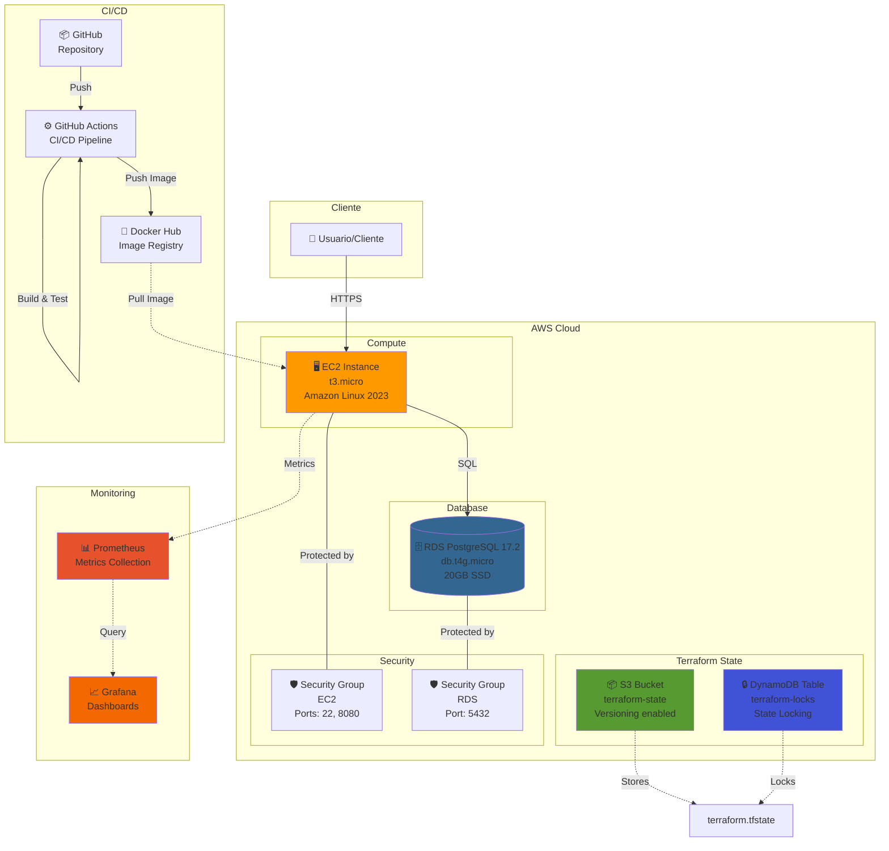
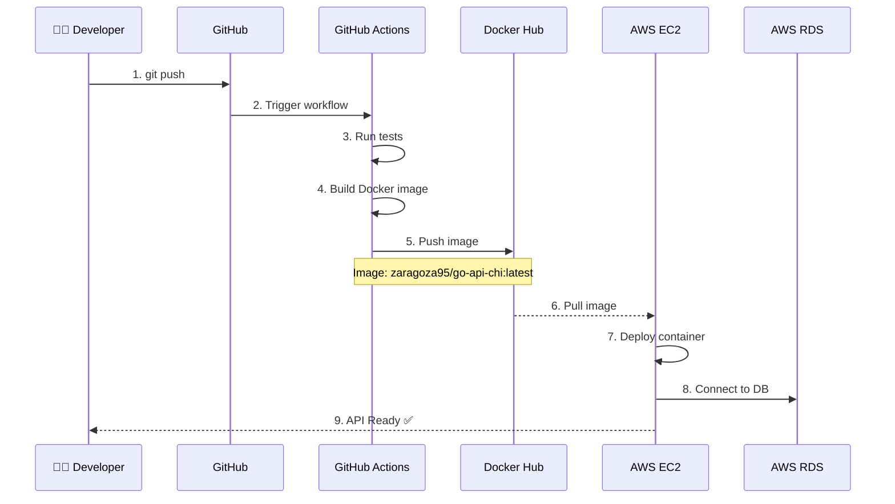
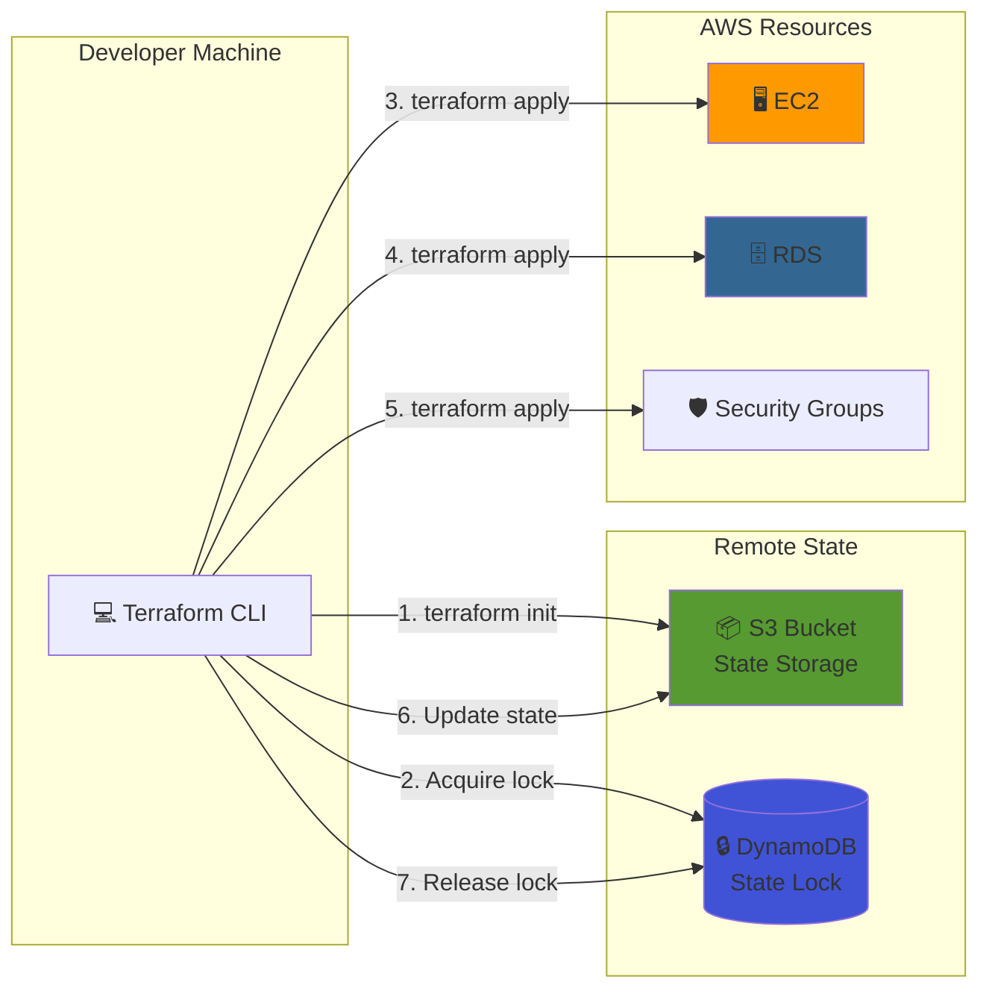
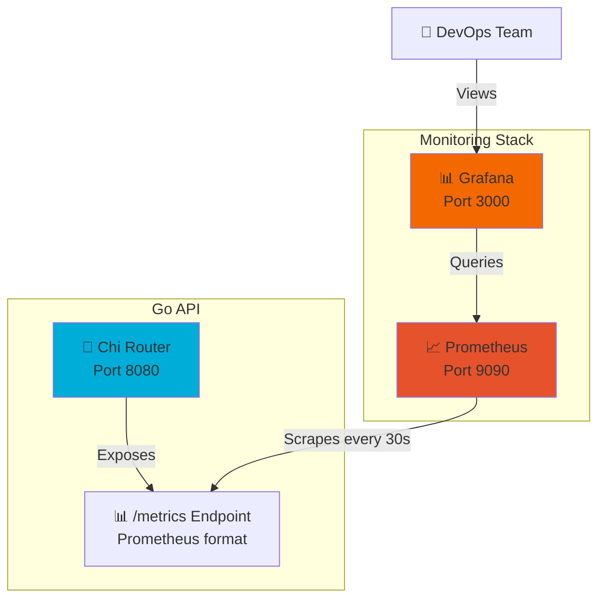
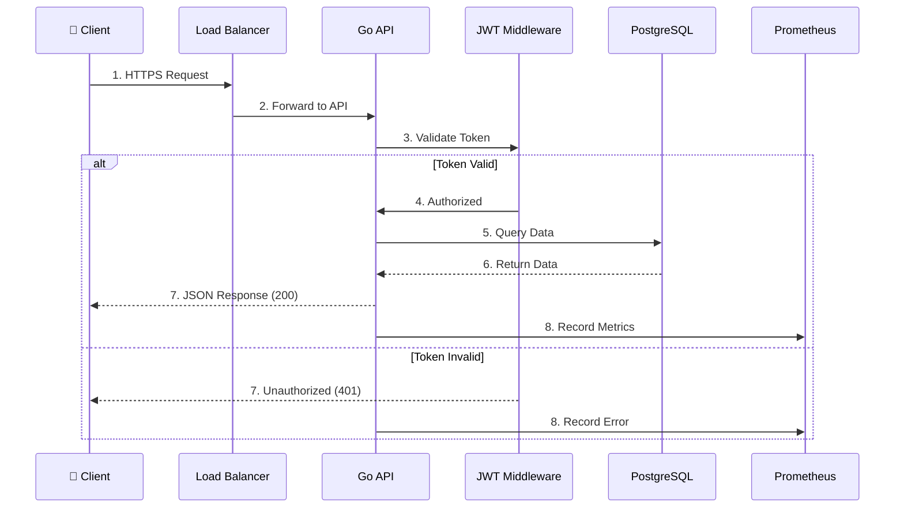

# 🏗️ Arquitectura del Sistema

## Diagrama General

## Flujo de Despliegue

## Infraestructura (Terraform)

## Stack de Monitoreo

## Flujo de Request

## Componentes Principales

### Backend (Go)
- **Framework:** Chi Router v5
- **Database:** PostgreSQL driver (lib/pq)
- **Auth:** JWT (golang-jwt)
- **Metrics:** Prometheus client

### Infrastructure (AWS)
- **Compute:** EC2 t3.micro
- **Database:** RDS PostgreSQL 17.2
- **Storage:** S3 (Terraform state)
- **Locking:** DynamoDB (Terraform)

### DevOps
- **IaC:** Terraform 1.14+
- **CI/CD:** GitHub Actions
- **Containers:** Docker + Docker Compose
- **Registry:** Docker Hub

### Monitoring
- **Metrics:** Prometheus
- **Visualization:** Grafana
- **Method:** RED (Rate, Errors, Duration)

---

## Seguridad

### Network
- ✅ RDS en subnet privada (no public IP)
- ✅ Security Groups con least privilege
- ✅ HTTPS en producción

### Application
- ✅ JWT para autenticación
- ✅ Middleware de autorización
- ✅ Validación de inputs

### Infrastructure
- ✅ Terraform state encriptado en S3
- ✅ Secrets en variables de entorno
- ✅ .gitignore para credenciales

---

## Escalabilidad

### Horizontal
- Auto Scaling Groups (futuro)
- Load Balancer (futuro)
- Multiple AZs (futuro)

### Vertical
- Ajustar instance types en Terraform
- Variables parametrizadas
- Sin downtime con Blue/Green

### Database
- RDS Read Replicas (futuro)
- Connection pooling
- Query optimization